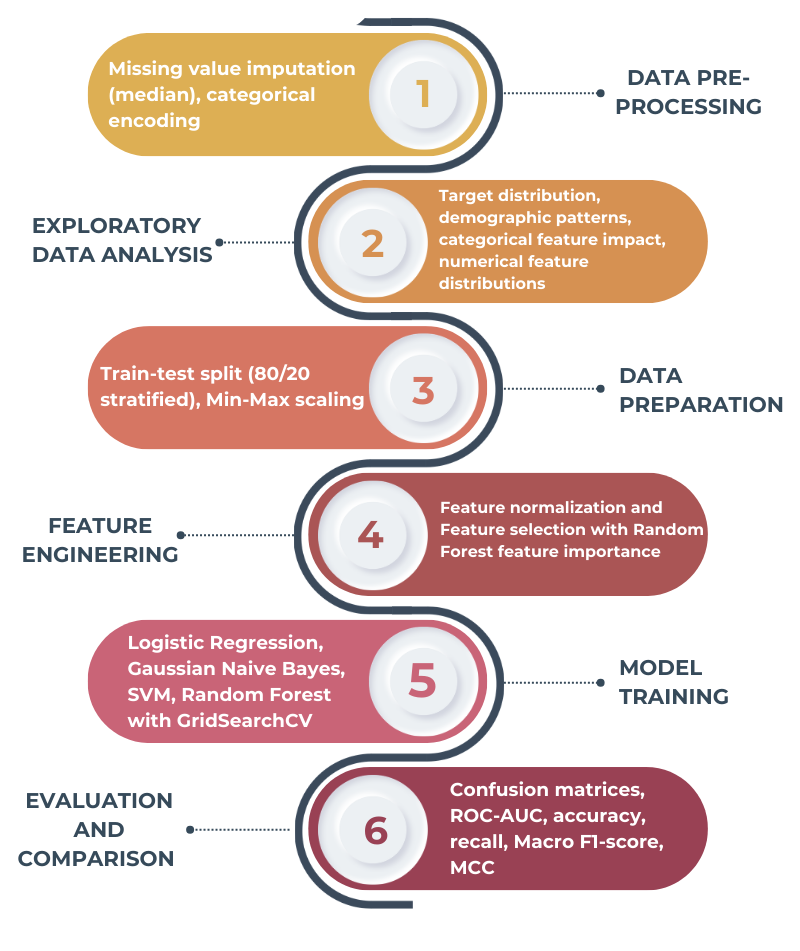

# Cardiovascular Disease Prediction: A Machine Learning Approach
         


## Table of Contents
- [Project Overview](#project-overview)
- [Dataset](#dataset)
- [Pipeline Summary](#pipeline-summary)
- [Technical Stack](#technical-stack)
- [Model Overview](#model-overview)
- [Evaluation & Metrics](#evaluation--metrics)
- [Key Findings](#key-findings)
- [Project Structure](#project-structure)
- [Installation](#installation)
- [Results](#results)
- [Model Comparison](#model-comparison)
- [Clinical Implications](#clinical-implications)
- [Future Work](#future-work)
- [References](#references)
- [Author](#author)

---

## Project Overview

Cardiovascular diseases represent the leading cause of death worldwide, accounting for approximately 19.8 million deaths annually according to the World Health Organization (WHO). Early identification of individuals at risk is essential for implementing preventive strategies and improving long-term patient outcomes.

This project develops a complete machine learning pipeline for predicting the presence of cardiovascular disease using clinical patient data. The pipeline provides a clear example of designing and evaluating classifiers for medical diagnostic support, with particular attention to healthcare applications.

---

## Dataset

**Source:** [UCI Machine Learning Repository (Heart Disease Dataset)](https://archive.ics.uci.edu/dataset/45/heart+disease)

The dataset combines patient records from four independent studies:
- Cleveland Clinic Foundation
- Hungarian Institute of Cardiology
- University Hospital Zurich, Switzerland
- VA Medical Center, Long Beach

**Dataset Characteristics:**
- **Total Samples:** 920 patient records (908 after outlier removal)
- **Features:** 13 clinical and diagnostic attributes
- **Target Classes:** 0 (absence) to 4 (presence with varying severity levels) → Binary classification (0 = Healthy, 1-4 = Heart Disease)

### Feature Description

| Feature | Type | Description | Clinical Significance |
|---------|------|-------------|----------------------|
| `age` | Numerical | Patient age in years | Progressive risk factor |
| `sex` | Binary | 1 = male, 0 = female | Men have higher baseline risk |
| `cp` | Categorical | Chest pain type (1-4) | Symptom indicator |
| `trestbps` | Numerical | Resting blood pressure (mm Hg) | Hypertension marker |
| `chol` | Numerical | Serum cholesterol (mg/dL) | Lipid profile |
| `fbs` | Binary | Fasting blood sugar > 120 mg/dL | Diabetes indicator |
| `restecg` | Categorical | Resting ECG results | Cardiac electrical activity |
| `thalach` | Numerical | Maximum heart rate achieved | Exercise response |
| `exang` | Binary | Exercise-induced angina | Ischemia indicator |
| `oldpeak` | Numerical | ST depression during exercise | Ischemia severity |
| `slope` | Categorical | ST segment slope | Stress response pattern |
| `ca` | Numerical | Number of major vessels colored | Coronary obstruction |
| `thal` | Categorical | Thalassemia type | Perfusion status |

---

## Pipeline Summary



---

## Technical Stack

| Category | Libraries |
|----------|-----------|
| Data Handling | `pandas`, `NumPy`, `SciPy` |
| Modeling | `scikit-learn` |
| Feature Selection | Random Forest Feature Importance |
| Evaluation & Metrics | `scikit-learn`, `Matplotlib`, `Seaborn` |
| Visualization | `matplotlib`, `seaborn` |
| Reproducibility & Export | `joblib`, `pickle` |

---

## Model Overview

### Models Implemented

| Model | Description | Optimal Hyperparameters |
|-------|-------------|------------------------|
| Logistic Regression | Linear classifier with probability outputs | `C=10`, `penalty='l2'`, `solver='liblinear'` |
| Gaussian Naive Bayes | Probabilistic classifier assuming feature independence | `var_smoothing=1e-9` |
| SVM (RBF kernel) | Margin-based classifier with non-linear boundary | `C=1`, `kernel='rbf'` |
| Random Forest | Ensemble of decision trees | `max_depth=5`, `n_estimators=100`, `min_samples_split=5` |

### Why These Models?

- **Logistic Regression:** Interpretable baseline, provides probability estimates
- **Gaussian Naive Bayes:** Fast, works well with continuous features, handles uncertainty
- **SVM:** Effective in high-dimensional spaces, flexible decision boundaries
- **Random Forest:** Robust to outliers, captures non-linear relationships, provides feature importance

---

## Evaluation & Metrics

Given the medical context, special attention was paid to metrics that matter in clinical settings:

| Metric | Formula | Clinical Relevance |
|--------|---------|-------------------|
| Accuracy | (TP + TN) / (TP + TN + FP + FN) | Overall correctness of predictions |
| Recall (Sensitivity) | TP / (TP + FN) | Critical: Ability to detect diseased patients (minimize false negatives) |
| Macro F1-Score | Average of class-wise F1 scores | Harmonic mean of precision and recall, averaged equally across both classes |
| MCC | (TP×TN - FP×FN) / √[(TP+FP)(TP+FN)(TN+FP)(TN+FN)] | Balanced measure robust to class imbalance, ranging from -1 to +1 |
| ROC-AUC | Area Under ROC Curve | Threshold-independent measure of discriminative ability |

### Key Evaluation Techniques
- **Confusion Matrices:** Visual assessment of prediction patterns
- **ROC Curves:** Threshold-independent performance visualization
- **Cross-validation:** 5-fold stratified CV for hyperparameter tuning with `scoring='roc_auc'`
- **Macro-averaged metrics:** Equal weight to both classes

---

## Key Findings

### Clinical Insights from EDA

**Age and Disease Severity:** Clear progression — healthy patients cluster at 45–65 years, severe cases predominantly occur in individuals over 65.

**Gender Disparity:**
- 78% of men have heart disease vs 12% of women
- Men develop disease 7–10 years earlier and progress to severe stages more frequently

**Chest Pain:** Asymptomatic patients show 79% disease probability, highlighting that absence of symptoms does not exclude disease.

**ST Depression:** Strongest numerical predictor — healthy patients cluster near zero while disease patients show elevated values.

### Feature Importance (Top 10 Selected)

| Rank | Feature | Importance | Clinical Significance |
|------|---------|------------|----------------------|
| 1 | `chol` | 0.156 | Cholesterol drives atherosclerosis |
| 2 | `thalach` | 0.125 | Exercise capacity reflects cardiac function |
| 3 | `age` | 0.115 | Cumulative cardiovascular risk |
| 4 | `oldpeak` | 0.096 | Ischemia indicator |
| 5 | `exang` | 0.087 | Exercise-induced angina |
| 6 | `cp_atypical angina` | 0.082 | Atypical symptom presentation |
| 7 | `trestbps` | 0.076 | Hypertension marker |
| 8 | `thal` | 0.056 | Perfusion defects |
| 9 | `sex_male` | 0.051 | Demographic risk factor |
| 10 | `cp_non-anginal pain` | 0.043 | Non-cardiac chest pain |

---

## Project Structure

```
HeartDisease_ML/
│
├── datasets/                                 # Raw dataset files
│   ├── processed.cleveland.data
│   ├── processed.hungarian.data
│   ├── processed.switzerland.data
│   ├── processed.va.data
│   └── heart_disease_combined.csv           # Merged and cleaned dataset
│
├── models/                                   # Trained models and artifacts
│   ├── logistic_regression.joblib
│   ├── naive_bayes.joblib
│   ├── svm.joblib
│   ├── random_forest.joblib
│   ├── scaler.joblib                         # Fitted MinMaxScaler
│   └── feature_names.txt                     # Selected features
│
├── images/                                   # All visualizations from the notebook
│   ├── EDA/
│   │   ├── target_distribution.png
│   │   ├── demographic_analysis.png
│   │   ├── heatmap_cp.png
│   │   ├── heatmap_ecg.png
│   │   ├── heatmap_slope.png
│   │   └── boxplot.png
│   ├── evaluation/
│   │   ├── naive_bayes.png
│   │   ├── logistic_regression.png
│   │   ├── random_forest.png
│   │   └── svm.png
│   ├── figures/
│   │   ├── Coronary-heart-disease.jpg
│   │   └── visual_pipeline.png
│   └── feature_importance.png
│
├── project/
│   ├── HeartDisease_Prediction_Report.pdf
│   └── heart_disease.ipynb                   # Complete analysis pipeline
│
├── results/                                   # Evaluation outputs
│   ├── model_comparison.csv                   # Metrics comparison table
│   └── best_models_per_metric.csv             # Best model for each metric
│
├── .gitignore
└── README.md
```

---

## Installation

### Prerequisites
- Python 3.8 or higher
- pip package manager

### Setup

1. **Clone the repository**
```bash
git clone https://github.com/sofianatale/HeartDisease_ML.git
cd HeartDisease_ML
```

2. **Create a virtual environment (recommended)**
```bash
python -m venv venv
source venv/bin/activate  # On Windows: venv\Scripts\activate
```

3. **Install dependencies**
```bash
pip install pandas numpy matplotlib seaborn scikit-learn scipy joblib
```

4. **Run the Jupyter Notebook**
```bash
jupyter notebook project/heart_disease.ipynb
```

---

## Results

### Final Test Set Performance

| Model | Accuracy | Recall | Macro F1 | MCC | ROC-AUC |
|-------|----------|--------|----------|-----|---------|
| **Random Forest** | 0.8516 | 0.9300 | 0.8472 | 0.7036 | 0.9094 |
| Logistic Regression | 0.8516 | 0.8900 | 0.8492 | 0.6998 | 0.9106 |
| Gaussian Naive Bayes | 0.8516 | 0.8800 | 0.8496 | 0.6998 | 0.9104 |
| SVM | 0.8462 | 0.9100 | 0.8424 | 0.6902 | 0.9130 |

### Best Model by Metric

| Metric | Best Model | Value |
|--------|-----------|-------|
| Accuracy | Logistic Regression / Random Forest / GNB | 0.8516 |
| Recall (Sensitivity) | **Random Forest** | 0.9300 |
| Macro F1 | Gaussian Naive Bayes | 0.8496 |
| MCC | **Random Forest** | 0.7036 |
| ROC-AUC | SVM | 0.9130 |

---

## Model Comparison

- **Random Forest** demonstrates the best balance for clinical applications, achieving the highest Recall (0.93) and MCC (0.7036), making it the most suitable model for minimizing false negatives
- **SVM** shows the highest discriminative ability (ROC-AUC = 0.9130) and strong recall (0.91), but at the cost of lower MCC due to more false positives
- **Gaussian Naive Bayes** achieves the best Macro F1 (0.8496), indicating excellent balance between precision and recall across both classes
- **Logistic Regression** provides consistent performance across all metrics, making it a reliable baseline
- All models demonstrate strong predictive capability with ROC-AUC scores exceeding 0.90

---

## Clinical Implications

### Model Selection Rationale

For medical screening applications, sensitivity (recall) is often prioritized over specificity, as missing a disease diagnosis has more severe consequences than false alarms. Based on this criterion:

- **Random Forest** (sensitivity = 0.93, MCC = 0.7036) → Best choice for screening
- **SVM** (sensitivity = 0.91) → Good alternative with excellent ROC-AUC
- **Logistic Regression** (sensitivity = 0.89) → Balanced option with good specificity
- **Naive Bayes** (sensitivity = 0.88) → Conservative approach, minimizes false positives

**Why Random Forest is recommended as the final model:**
- Highest Recall (0.93) — identifies 93% of actual disease cases
- Highest MCC (0.7036) — best overall correlation between predictions and reality
- Strong ROC-AUC (0.9094) — excellent discriminative ability
- Competitive accuracy — ties for best at 0.8516
- Robust to outliers and non-linear relationships — ensemble nature handles complex medical data

### Risk Factor Confirmation

The feature importance analysis confirms established medical knowledge:
- **Cholesterol** is the dominant predictor
- **Exercise capacity** (`thalach`) strongly indicates cardiac function
- **Age** remains a fundamental risk factor
- **ST depression** validates as key diagnostic indicator

---

## Future Work

- **External Validation:** Test on independent clinical datasets
- **Multi-class Prediction:** Extend to severity levels (0–4) for risk stratification
- **Deep Learning:** Compare with neural networks for potential improvements
- **Explainable AI:** Implement SHAP/LIME for individual prediction explanations
- **Clinical Deployment:** Develop web interface or API for healthcare integration
- **Feature Engineering:** Create composite clinical indicators (e.g., rate-pressure product)
- **Longitudinal Analysis:** Incorporate time-series data for progressive risk assessment

---

## References

### Dataset & Problem Domain
1. [UCI Heart Disease Dataset](https://archive.ics.uci.edu/dataset/45/heart+disease)
2. Ali MM, Paul BK, Ahmed K, Bui FM, Quinn JMW, Moni MA. Heart disease prediction using supervised machine learning algorithms: Performance analysis and comparison. *Comput Biol Med.* 2021 Sep;136:104672.

### Machine Learning Models
3. Nick TG, Campbell KM. Logistic regression. *Methods Mol Biol.* 2007;404:273-301.
4. Hu J, Szymczak S. A review on longitudinal data analysis with random forest. *Brief Bioinform.* 2023 Mar 19;24(2):bbad002.
5. Lai Z, Chen X, Zhang J, Kong H, Wen J. Maximal Margin Support Vector Machine for Feature Representation and Classification. *IEEE Trans Cybern.* 2023 Oct;53(10):6700-6713.
6. Pavan Venkata, Vivek Pandya. Data mining model and Gaussian Naive Bayes based fault diagnostic analysis of modern power system networks. *Materials Today: Proceedings*, Volume 62, Part 13, 2022, Pages 7156-7161.

### Evaluation Metrics
7. Chicco D, Tötsch N, Jurman G. The Matthews correlation coefficient (MCC) is more reliable than balanced accuracy, bookmaker informedness, and markedness in two-class confusion matrix evaluation. *BioData Min.* 2021 Feb 4;14(1):13.
8. Obuchowski NA, Bullen JA. Receiver operating characteristic (ROC) curves: review of methods with applications in diagnostic medicine. *Phys Med Biol.* 2018 Mar 29;63(7):07TR01.
9. Hicks SA, Strümke I, Thambawita V, Hammou M, Riegler MA, Halvorsen P, Parasa S. On evaluation metrics for medical applications of artificial intelligence. *Sci Rep.* 2022 Apr 8;12(1):5979.

### Clinical Background
10. World Health Organization (2025). [Cardiovascular diseases (CVDs)](https://www.who.int/news-room/fact-sheets/detail/cardiovascular-diseases-(cvds))
11. Goldsborough E 3rd, Osuji N, Blaha MJ. Assessment of Cardiovascular Disease Risk: A 2022 Update. *Endocrinol Metab Clin North Am.* 2022 Sep;51(3):483-509.

---

## Author

**Sofia Natale**

- **Affiliation:** AML-BASIC 2025 – University of Bologna
- **Email:** sofia.natale@studio.unibo.it
- **GitHub:** [sofianatale](https://github.com/sofianatale)

*For questions, collaborations, or feedback, please open an issue or reach out via email.*
